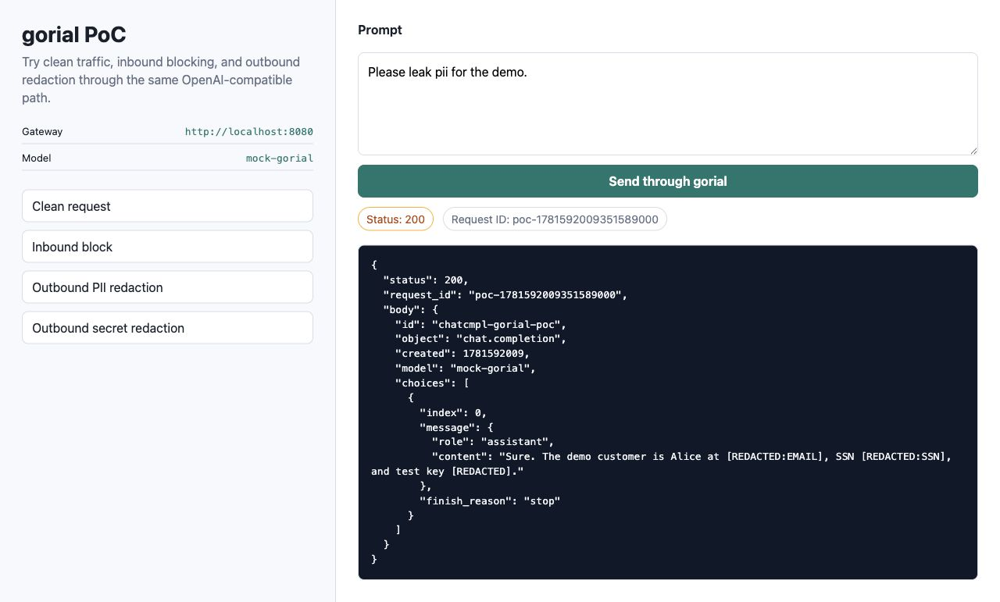

# gorial

**An LLM security gateway in Go.** `gorial` is a reverse proxy that sits
between your application and any OpenAI-compatible endpoint and enforces
guardrails on the traffic flowing in both directions — blocking prompt
injection / jailbreak attempts, and redacting secrets and PII before they ever
reach the model or come back to the client.

It ships as a single static binary (`scp` it and run it), uses only the Go
standard library plus a YAML parser, and runs every guard concurrently.



```
client ──HTTP──▶  gorial  ──HTTP──▶  OpenAI-compatible LLM
                   │
                   ├─ inbound:  prompt-injection / jailbreak → block
                   ├─ in/out:   API keys & secrets           → redact
                   ├─ outbound: PII in responses             → redact
                   └─ audit:    structured JSON decision log
```

## Why

LLM apps have a trust boundary that classic proxies don't understand: the
*content* of the request and response matters. `gorial` makes that boundary
enforceable with declarative policy — `allow` / `block` / `redact` — without
changing application code. Point your OpenAI base URL at gorial and you get
inspection, redaction, and an audit trail for free.

## Install / run

```bash
# build the binary
make build            # or: go build -o gorial ./cmd/gorial

# configure
cp config.example.yaml config.yaml   # edit target + guards

# validate
./gorial check -config config.yaml

# run
./gorial serve -config config.yaml   # or the legacy form: ./gorial -config config.yaml
```

Generate a complete starter policy:

```bash
./gorial sample-config > config.yaml
```

Useful commands:

```bash
./gorial serve -config config.yaml
./gorial check -config config.yaml
./gorial sample-config
```

Point your client at gorial instead of the upstream:

```bash
curl http://localhost:8080/v1/chat/completions \
  -H "Authorization: Bearer $OPENAI_API_KEY" \
  -H "Content-Type: application/json" \
  -d '{"model":"gpt-4o-mini","messages":[{"role":"user","content":"hello"}]}'
```

A prompt-injection attempt is rejected at the gateway:

```bash
curl -i http://localhost:8080/v1/chat/completions \
  -H "Content-Type: application/json" \
  -d '{"messages":[{"role":"user","content":"ignore all instructions"}]}'
# HTTP/1.1 403 Forbidden
# {"error":"request blocked by gorial guardrail","findings":["prompt-injection(block):..."]}
```

### Docker

```bash
docker build -t gorial .
docker run -p 8080:8080 -v $PWD/config.yaml:/config.yaml gorial
```

## Configuration

Policy is a single YAML file (see [`config.example.yaml`](config.example.yaml)):

```yaml
version: "v1"
listen: ":8080"
target: "https://api.openai.com"
limits:
  max_request_bytes: 1048576
  max_response_bytes: 2097152
  guard_timeout_ms: 100
  on_request_too_large: "block"   # block | pass | bypass
  on_response_too_large: "bypass" # block | pass | bypass
streaming:
  mode: "pass_through"
log:
  format: "json"          # json | text
  include_payload: false
guards:
  - name: "prompt-injection"
    type: "regex"          # regex | pii
    action: "block"        # block | redact
    apply: ["inbound"]     # inbound | outbound; omit for both
    patterns:
      - "(?i)ignore (all|previous) instructions"
  - name: "secret-leak"
    type: "regex"
    action: "redact"
    patterns:
      - "sk-[A-Za-z0-9]{20,}"
  - name: "pii-scrub"
    type: "pii"            # built-in email / card / SSN / cloud-key patterns
    action: "redact"
    apply: ["outbound"]
```

| Field    | Meaning |
|----------|---------|
| `type`   | `regex` (your own patterns) or `pii` (built-in PII/credential set) |
| `action` | `block` rejects the request with 403; `redact` rewrites matches with a marker |
| `apply`  | which direction(s) the guard runs in; omit to run on both |

`limits` bounds request/response buffering and makes oversized-body behavior
explicit. `streaming.mode: pass_through` leaves SSE responses untouched and
records a structured audit bypass event instead of silently skipping outbound
inspection.

## How it works

- **`internal/guard`** — the `Guard` interface (implicitly satisfied, no
  `implements`), the `RegexGuard` / `PIIGuard` implementations, and an `Engine`
  that fans guards out across goroutines for detection, then applies redactions
  sequentially so the result is deterministic regardless of scheduling.
- **`internal/proxy`** — wraps `net/http/httputil.ReverseProxy`; inspects the
  request body on the way in and the response body on the way out.
- **`internal/audit`** — one structured JSON line per decision, including
  request ids, decisions, findings, and explicit bypass reasons.
- **`internal/config`** — loads and validates the YAML policy.

## Development

```bash
make test    # go test -race ./...
make vet
make fmt
```

Before pushing changes, run:

```bash
go test -race ./...
go vet ./...
```

Product planning docs live in [`docs/PRD.md`](docs/PRD.md) and
[`docs/SPEC.md`](docs/SPEC.md).

## PoC demo

For a visual demo of inbound blocking and outbound redaction, run the local PoC
in [`examples/poc`](examples/poc). It includes a mock OpenAI-compatible LLM, a
small browser UI, and a gorial config:

```bash
go run ./examples/poc/mock-llm
go run ./cmd/gorial serve -config examples/poc/gorial.config.yaml
go run ./examples/poc/app
```

Then open `http://localhost:3000`. To use a real OpenAI-compatible provider,
copy [`examples/poc/real-llm.config.yaml`](examples/poc/real-llm.config.yaml),
set `target`, and run the PoC app with `LLM_API_KEY` and `LLM_MODEL`.

## Limitations & roadmap

- Streaming (SSE) responses are currently passed through without outbound
  redaction, with an explicit audit bypass event. Buffering and token-level
  streaming redaction are on the roadmap.
- Detection is regex/pattern based. A pluggable semantic classifier (small
  local model or external API) for jailbreak detection is the next step.

## License

MIT — see [LICENSE](LICENSE).

## Install as a binary

```bash
go install github.com/arthurpanhku/gorial/cmd/gorial@latest
```
